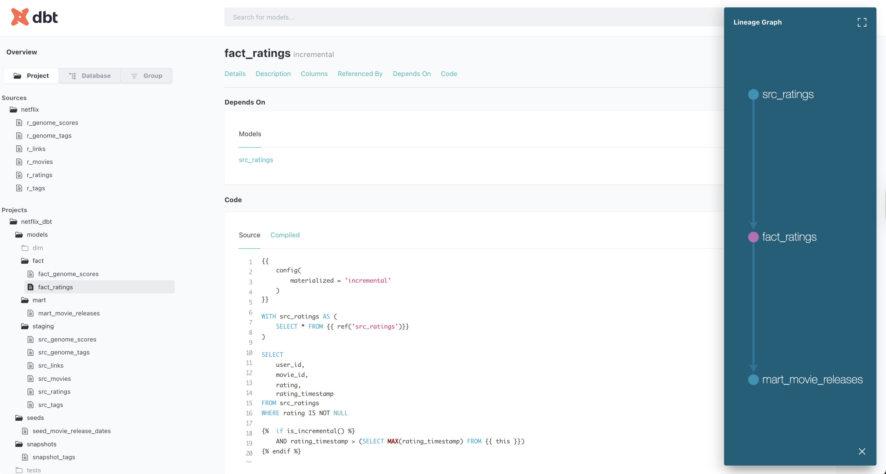
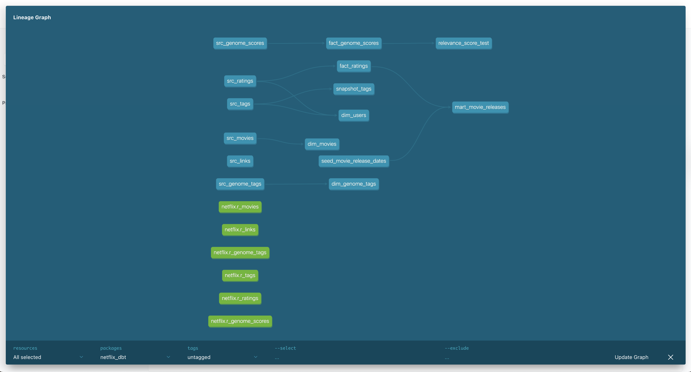
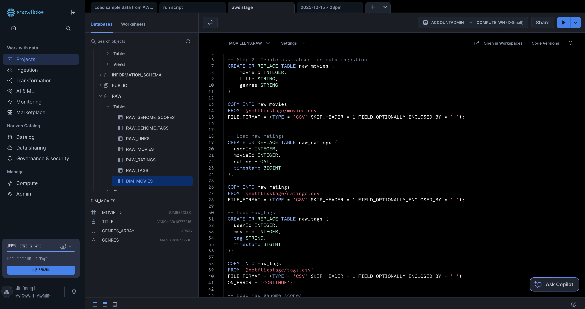

# 🎬 Netflix dbt Demo - A Complete Data Engineering Journey! 🚀



Welcome to the **Netflix dbt Demo** - your gateway to mastering modern data engineering with **Snowflake**, **AWS S3**, and **dbt**! This project demonstrates how to build a robust, scalable data pipeline using industry-standard tools. 🎯

## 🌟 What You'll Learn

This project is your **complete guide** to:

- 🏗️ **Data Staging**: Load data from AWS S3 into Snowflake
- 🗄️ **Schema Design**: Create tables, views, and define proper schemas in Snowflake
- 🔧 **dbt Mastery**: Explore all popular dbt features including:
  - 📊 **Models** (staging, dimension, fact, and mart layers)
  - 🌱 **Seeds** (static reference data)
  - 📸 **Snapshots** (slowly changing dimensions)
  - ⚡ **Macros** (reusable SQL logic)
  - 🧪 **Tests** (data quality validation)
  - 📚 **Documentation** (auto-generated docs)
  - 🎨 **Lineage** (visual data flow)

## 📊 Dataset: MovieLens 20M

We're using the famous **[MovieLens 20M Dataset](https://grouplens.org/datasets/movielens/20m/)** which includes:
- 🎭 **27,000 movies** with rich metadata
- 👥 **138,000 users** and their preferences  
- ⭐ **20 million ratings** (the heart of our analysis!)
- 🏷️ **465,000 tag applications** for content categorization
- 🧬 **Tag genome data** with 12 million relevance scores across 1,100 tags

Perfect for learning data modeling and analytics! 🎪

## 🏗️ Project Architecture

```
📁 netflix_dbt/
├── 🗂️ models/
│   ├── 📊 staging/     # Raw data transformation
│   ├── 🎯 dim/         # Dimension tables
│   ├── 📈 fact/        # Fact tables  
│   └── 🎪 mart/        # Business-ready datasets
├── 🌱 seeds/           # Reference data
├── 📸 snapshots/       # SCD tracking
├── ⚡ macros/          # Reusable logic
├── 🧪 tests/           # Data quality tests
└── 📚 docs/            # Auto-generated documentation
```

## 🖼️ Screenshots Gallery

### 🎯 dbt Models & Lineage

*Beautiful data lineage showing how raw data flows through staging → dimensions → facts → marts*

### 📚 Auto-Generated Documentation

*Interactive documentation with column descriptions, tests, and lineage graphs*

### ❄️ Snowflake Data Warehouse

*Your data warehouse in action - tables, views, and query results*

## 🚀 Quick Start Guide

### Prerequisites

- 🍎 **macOS** (this guide is Mac-focused)
- 💻 **VS Code** or **Cursor** (we recommend Cursor for the best dbt experience!)
- ☁️ **AWS Account** with S3 access
- ❄️ **Snowflake Account** (free trial available)

### 1. 🔑 Environment Setup

#### AWS Configuration
```bash
# Set your AWS credentials
export AWS_ACCESS_KEY_ID="your_access_key_here"
export AWS_SECRET_ACCESS_KEY="your_secret_key_here"
export AWS_DEFAULT_REGION="us-east-1"  # or your preferred region
```

#### Snowflake Configuration
```bash
# Set your Snowflake credentials
export SNOWFLAKE_USER="your_username"
export SNOWFLAKE_PASSWORD="your_password"
export SNOWFLAKE_ACCOUNT="your_account_identifier"
export SNOWFLAKE_WAREHOUSE="COMPUTE_WH"
export SNOWFLAKE_DATABASE="MOVIELENS"
export SNOWFLAKE_SCHEMA="DEV"
```

### 2. 🛠️ dbt Installation

#### For VS Code Users:
```bash
# Install dbt
pip install dbt-snowflake

# Install the dbt Power User extension
# Search for "dbt Power User" in VS Code extensions
```

#### For Cursor Users (Recommended! 🎯):
```bash
# Install dbt
pip install dbt-snowflake

# Cursor has excellent dbt support built-in!
# Just open your dbt project and start coding
```

### 3. 📦 Project Setup

```bash
# Clone and navigate to the project
git clone <your-repo-url>
cd netflix_dbt_demo/netflix_dbt

# Install dbt packages
dbt deps

# Test your connection
dbt debug

# Run the full pipeline
dbt run

# Run tests
dbt test

# Generate documentation
dbt docs generate
dbt docs serve
```

## 🎯 Key dbt Features Demonstrated

### 📊 Models (The Heart of dbt)
- **Staging Layer**: Clean and standardize raw data
- **Dimension Tables**: `dim_movies`, `dim_users`, `dim_genome_tags`
- **Fact Tables**: `fact_ratings`, `fact_genome_scores`
- **Mart Layer**: `mart_movie_releases` for business analytics

### 🌱 Seeds
- **Reference Data**: Movie release dates and other static data
- Perfect for lookup tables and configuration data

### 📸 Snapshots
- **SCD Type 2**: Track changes to tags over time
- Maintain historical data integrity

### ⚡ Macros
- **Reusable Logic**: Custom SQL functions
- **DRY Principle**: Don't repeat yourself!

### 🧪 Tests
- **Data Quality**: Ensure data integrity
- **Business Rules**: Validate rating ranges, uniqueness
- **Custom Tests**: Tailored to your specific needs

### 📚 Documentation
- **Auto-Generated**: From your YAML files
- **Interactive**: Click through lineage graphs
- **Rich Descriptions**: Column-level documentation

## 🎪 Fun Features to Explore

1. **🎬 Movie Analytics**: Find the most popular movies by genre
2. **⭐ Rating Patterns**: Analyze user rating behaviors  
3. **🏷️ Tag Evolution**: Track how movie tags change over time
4. **📊 Data Quality**: Ensure your data is clean and reliable
5. **🔄 Incremental Processing**: Handle large datasets efficiently

## 🛠️ Common Commands

```bash
# Run specific models
dbt run --select staging
dbt run --select dim_movies

# Run tests
dbt test
dbt test --select fact_ratings

# Generate and serve docs
dbt docs generate
dbt docs serve

# Create snapshots
dbt snapshot

# Seed data
dbt seed
```

## 🎓 Learning Resources

This project is inspired by the excellent work of **[Darshil Parmar](https://grouplens.org/datasets/movielens/20m/)** and his comprehensive YouTube course:

🎥 **[Complete dbt Course on YouTube](https://www.youtube.com/watch?v=zZVQluYDwYY&t=6296s)**

A huge shoutout to Darshil for creating such an amazing learning resource! 🙏

## 🤝 Contributing

Found a bug? Have an idea for improvement? We'd love your contribution!

1. 🍴 Fork the repository
2. 🌿 Create a feature branch
3. 💻 Make your changes
4. 🧪 Test thoroughly
5. 📝 Submit a pull request

## 📄 License

This project is open source and available under the [MIT License](LICENSE).

## 🎉 Acknowledgments

- 🎬 **[MovieLens Research Group](https://grouplens.org/datasets/movielens/20m/)** for the amazing dataset
- 🎓 **[Darshil Parmar](https://www.youtube.com/watch?v=zZVQluYDwYY&t=6296s)** for the incredible dbt course
- ❄️ **Snowflake** for the powerful data warehouse
- 🔧 **dbt Labs** for the amazing transformation tool
- ☁️ **AWS** for the cloud infrastructure

---

**Happy Data Engineering!** 🚀✨

*Remember: The best way to learn data engineering is by building real projects. This demo gives you hands-on experience with industry-standard tools and best practices. Start building, keep learning, and most importantly - have fun!* 🎪
